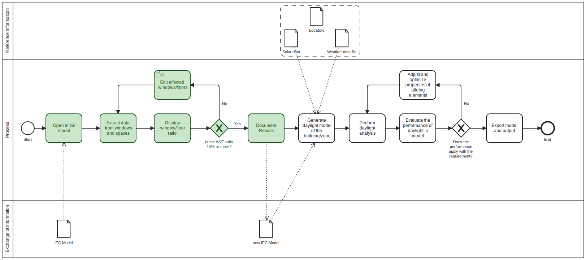

# Assingment 2 - Group 5
#### Use case
*Describe the use case you have chosen.*
The chosen use case is the identification of the Window-to-Floor Ratio (W2F ratio), and checking if it is above 10%, which is an common rule of thumb when designing buildings, and is often used as the first daylight indicator, before diving into advanced daylight analysis. 
#### Users
*Who is the use case for?* 
This use case can be used in the early design stage by architects, engineers or companies interested in daylight analysis and want to check if the building design somewhat follows the rule of thumb about a W2F ratio of 10%.
#### Non BIM expertise
*What disciplinary (non BIM) expertise did you use to solve the use case?*
The general knowledge, of an architectural engineer about daylight, was used to identify which building elements were relevant to analyse, as well as calculating the area of the windows, and the calculation of the W2F ratio. 
#### IFC concepts
*What IFC concepts did you use in your script (would you use in your script)?*
Firstly, within the `IfcWindow` the two attributes `OverallHeight` and `OverallWidth` were used to calculate the window area. Whether a window is an external window or not was checked by looking into the `IfcPropertySet` under `WindowCommon` and seeing if the attribute `IsExternal` was true or false.

Next, the windows’ relationship to the spaces was found by looking within the `IfcSpace` into the `BoundedBy`-objects and seeing if any `IfcWindows` were defined as a `RelatedBuildingElement`. The collected data was then filtered, so it only contained the external windows.

At last the floor area of the spaces were found within the `IfcQuantityArea` via the `IfcElementQuantity` and the `IfcSpace`.

#### Disciplinary analysis
*What disciplinary analysis does it require?*
This use case only requires the disciplinary analysis of calculating window areas (A = h*w) and the W2F ratios (W2F = A~wind~ / A~floor~).
#### Relevant Building Elements
*What building elements are you interested in?*
For this use case the relevant building elements (objects) are the spaces and their windows. 
#### Preliminary work for this use case
*What (use cases) need to be done before you can start your use case?*
Before starting this use case the basic architectural model should be done, meaning the basic design of the building. The spaces in the architectural model need to be defined, as well as window placement; window geometry; space area, and also if the windows are external or not.
#### Input data
*What is the input data for your use case?*
The input data of this use case is a local architectural IFC file, with the window geometry, window placement, space area, and also if the windows are external or not.
#### Interdependency
*What other use cases are waiting for your use case to complete?*
This use case is not a necessary step in the whole daylight analysis process, however it is a quick check of the W2F ratio, before starting the detailed daylight analysis. Thus, it is beneficial from an economical perspective to run this use case right after the architectural drawings are done, to see if further changes are needed in the design to have a decent quality of daylight in the spaces, before using a lot of time and money on make detail daylight analysis. 

# BPMN

