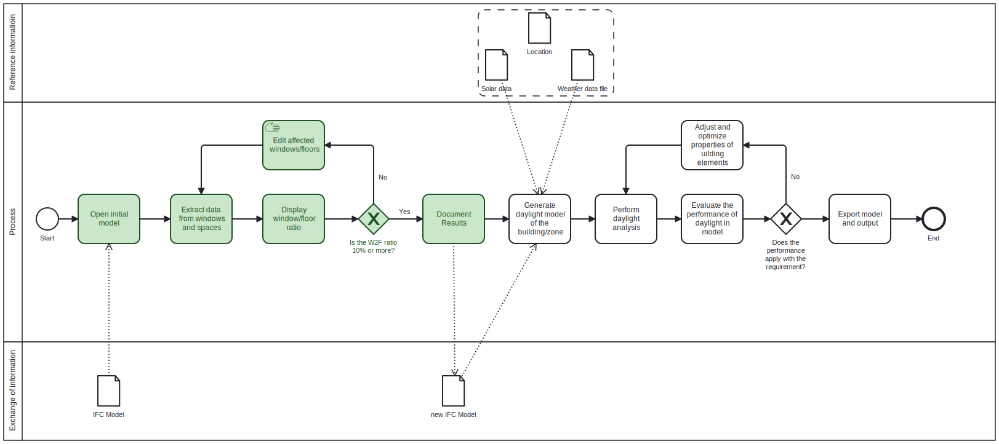

# Assingment 2 - Group 5

## Describe the use case you have chosen. 
The chosen use case is the identification of the Window-to-Floor Ratio (W2F ratio), and checking if it is above 10%, which is an common rule of thumb when designing buildings, and is often used as the first daylight indicator, before diving into advanced daylight analysis. 
## Who is the use case for? 
This use case can be used in the early design stage by architects, engineers or companies interested in daylight analysis and want to check if the building design somewhat follows the rule of thumb about a W2F ratio of 10%.   
## What disciplinary (non BIM) expertise did you use to solve the use case 
The general knowledge of an architectural engineer about daylight was used to identify which components were relevant to analyse, as well as the simple equation (A = h*w) to calculate the area of the window.
## What IFC concepts did you use in your script (would you use in your script) 
Firstly, ‘ID’ is used to determine which data/property belongs to which window. Within the ‘IfcWindow’ the two attributes ‘OverallHeight’ and ‘OverallWidth’ were used. And welther a window is an external window or not was check by using the ‘IsExternal’ within the ‘WindowCommon’ in the ‘PropertySet’.  
## What disciplinary analysis does it require? 
It only requires the calculation of the W2F ratio. 
## What building elements are you interested in? 
For this use case we are interested in the windows and their impact of natural light, and what spaces they affect.  
## What (use cases) need to be done before you can start your use case? 

## What is the input data for your use case? 
Window area; Window placement; Window geometry; Space geometry 
## What other use cases are waiting for your use case to complete? 

# BPMN

