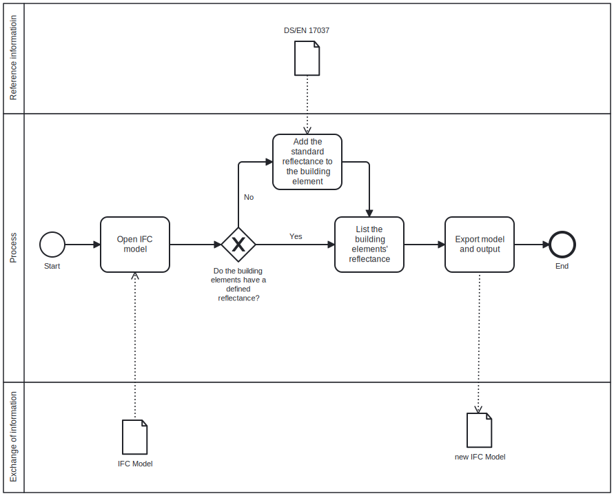
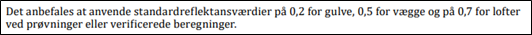

**BIM Execution Plan**

**Use case** : The chosen use case is a daylight analysis consisting of a daylight autonomy. The script should: read certain information from the IFC model; import external information from other files and formats; combine the two, and compare the results to regulations, requirements, and goals; edit object properties in order to meet the regulations, requirements, and goals. However, due to limited time and programming skills, the focus of this assignment is on the preparation of the IFC-model, or rather the addition of surface reflectance in case of missing data.

**Users** : this case can be used by the designers, architects, and daylight engineers in the early stages of the project.

**Project Goals:**

The overall goal is to generate a daylight autonomy from an IFC-model. However, in order to reach this goal, it is necessary to define some small milestones along the way.

|       Priority (1-3)     |    Project Goal     |     Potential BIM Uses          |
|--------------------------|:-------------------:|:-------------------------------:|
|      1 = Most Important  |                     |                                 |
|      1                   |     Analyse the current daylight conditions in a given building.   |     Capture Existing Conditions, Author Design Model, Analyse Lightning Performance      |
|      1                   |     Compare current conditions to existing regulations.            |     Analyse Program Requirements, Review Design Model, Coordinate Design Model     |
|      1                   |     Adjust and optimize properties of building elements to meet the regulations.  |     Author Design Model, Review Design Model, Analyse Lighting Performance, Analyse Program Requirements, Coordinate Design Model  |

**BIM Process Design:**

Figure 1: BIM Overview Map
 
 
When looking at the BIM overview map, the process can be described as follows. This use case starts with receiving and opening an IFC-model of the architectural BIM model. The presence of properties relevant to the daylight analysis in the IFC-model is then checked. These properties are listed in the section "BIM information exchange". If some of these properties are missing the developed script along with other future scripts should add standard values, so that it would be possible to conduct a daylight analysis with this IFC-model. When the standard values are assigned, the new IFC-model is exported. The new IFC-model is then used in combination with external data like solar-, weather- and location data to create a daylight model of the building or the zone of interest. Next the daylight analysis is performed, and the results are then evaluated. If the result does not comply with the requirements, the properties of the building elements require adjustment and optimisation, and then the daylight analysis is run again. When all requirements are met, the model and the results are exported.

 Figure 2: Detailed BIM Use Process Map
  
  

The Detailed BIM Use Process Map shows the process regarding the developed script **Main.py**. This use case starts with receiving and opening an IFC-model of the architectural BIM model. The presence of surface reflectance of the building elements in the IFC-model is checked. If some of these surface reflectances are missing, the developed script **Main.py** will assign standard values from the Danish Standard DS/ISO 17037 as a new IfcCustomPropertySet, so that it would be possible to conduct a daylight analysis with this IFC-model. When the standard values are assigned, the new IFC-model is exported.

**BIM Information Exchanges (properties needed for the use case):**

In order to run the script and execute the daylight analyse, inputs, which are listed below, are needed. The architects must provide an IFC-model containing the following:

**_Building orientation and location:_**
The building orientation in relation to true north should be provided, in order to calculate the amount of sunlight each façade, window, and space will receive. The building location is also important, since the suns position on the sky depends of this. The building location in the form of Latitude and Longitude should therefore also be provided in the IFC-model. With these coordinates the azimuth angle and the elevation of the sun can be found.

**_Surrounding buildings_:** A simple model/boxes representing the neighbouring building should be included in the IFC-model as well. The neighbouring buildings should as a minimum have the attribute reflectance defined. More details are not necessary, however if more precise results are wanted, the neighbouring buildings could be modelled with more detail.

**_Ground_:** The IFC-model should also have the ground defined.

**_Facade_:**The reflectance of the façade (ext. surface) of the analysed zone is also necessary.

**_Space geometry_:** The dimensions of the spaces should be defined to assign the amount of daylight falling on a certain point.

**_Analysis surface_:** The surface of analysis is typically the floor. For this surface the direction is important to have right, which it is when the surface normal is positive.

**_Window placements and properties_:** The IFC attributes needed regarding the window placement would be the sill height and the (x,y) coordinates of two corners, along with the orientation and angel. The IFC attributes needed regarding the window properties are the frame ratio, light transmittance of the glazing.

**_Internal surfaces_ :** The reflectance of the surfaces in rooms are necessary to be defined, for the daylight analysis. If this IFC attribute is not defined in the IFC-model, a script can assign reflectance to different materials, according to tables based on empirical data. Additionally, some standard values for building elements can be found in DS/EN 17037:2018+A1:2021.

**_Solar shading geometry and control_:** If solar shading is used, the geometry and location of the shading object/device is needed, to determine the amount of sunlight coming into the space.

If these described attributes for the listed entities are missing from the IFC-model, the provided script **Main.py** along with some other future scripts would provide/add the necessary information for the daylight analysis to the IFC-model and thereby produce a new improved IFC-model. This information/data would mainly be standard values from the Danish Standard (DS/ISO 17037), used when doing a daylight analysis.

Further a sky model including date, time, sky condition and weather data would then be used to analyse the daylight in the spaces in the IFC-model.

As previously stated, the focus of this assignment is the process of assigning missing attributes to a IFC-model regarding the materials. The attributes of Radiance materials have different names than the attributes in the IFC materials. Therefore, a buildingSMART Data Dictionary (bSDD) has been developed, to show what the attributes in Radiance correspond to in the IFC environment.

 
_Table 1: buildingSMART Data Dictionary (bSDD) of the material attributes._

|     Radiance material    |          |     IfcMaterial                                     |     Comments                                                                                                                                                                        |
|--------------------------|----------|-----------------------------------------------------|-------------------------------------------------------------------------------------------------------------------------------------------------------------------------------------|
|     RGB or Hue           |     &harr;    |     IfcColourRgb                                    |     The colour code of the material:      Red, Green, Blue                                                                                                                          |
|     Transmittance        |     &harr;    |     IfcSurfaceStyleRendering (Transparency)         |     The fraction of light that gets transmitted through the material.                                                                                                               |
|     Specularity          |     &harr;    |     IfcSurfaceStyleRendering (SpecularColour)       |     The mirror-like reflection of waves, where the angle of incidence   and the angle of reflection are equal.     It is a number between 0.5-1.0     0.5 = dirty \| 1.0 = clean    |
|     Roughness            |     &harr;    |     IfcPropertySet     (Roughness)                  |     Is a number between 0-0.5     0 = polished \| 0.5 = roughened                                                                                                                   |
|     Material type        |     &harr;    |     IfcSurfaceStyleRendering (ReflectanceMethod)    |     The types of choice are:      In Radiance: Plastic, Metal, Dielectric, Trans, Mirror etc.     In IFC: PLASTIC, METAL, GLASS, MATT, MIRROR etc.                                  |
|     Reflectance          |     &harr;    |     IfcCostumPropertySet                            |     The ratio of the reflected light to the incident light.     Standard reflectances:     Floor = 0.2 \| Walls = 0.5 \| Ceiling = 0.7                                              |
