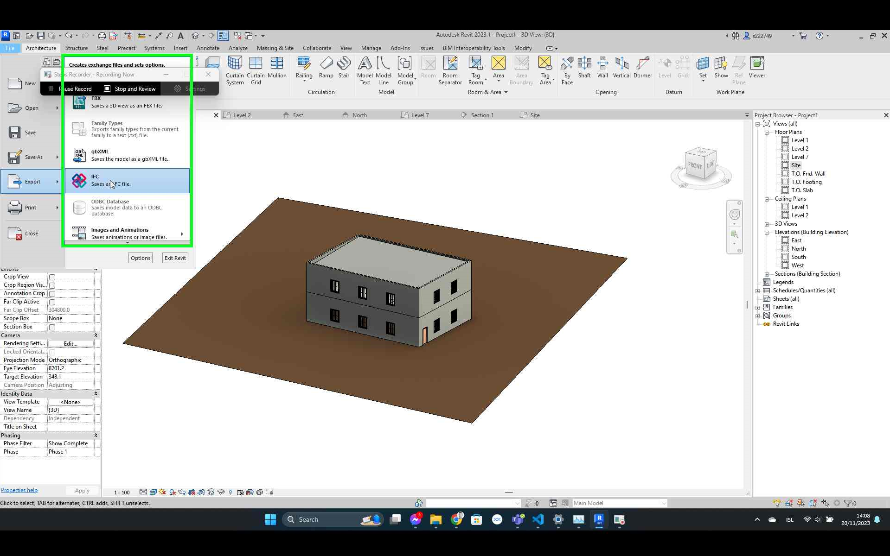

## From Revit to IFC
### Export IFC file from Revit:
1.  In case the model you want to edit is a Revit Autodesk format, then start by opening the model in Revit Autodesk. 
2.  Press the **File** tab, in the top left corner, on Revit’s ribbon. Then choose **Export** &rarr; **IFC**.
> 
4.  A dialog box will appear, asking for the location where the IFC file should be saved. You can either type a directory, or find it by clicking **Browse** and choosing the the folder. 
5.  For **Current selected setup**, select the IFC setup to use to create the file and click **Modify setup**. There are 9 built-in setups. These setups correspond to the IFC version options.
    1. Under Additional Content tab:
       *    _Export rooms in 2D viwes_ – exports all rooms in the model.
    2. Under Peoperty Set tab:
       *    _Export Revit Property Set_ – exports Revit-specific property sets. This box should be ticked.
       *    _Export IFC common property set_ – this box should also be ticked. The other boxes are not relevant for the project at hand, so they need not to be ticked.
    3. Under Advanced tab:
       *    _Use family and type name for reference_ – neccessery to identify this box should be ticked.
       *    _Use 2D room bounderies_ 
6.	Press **Export**
