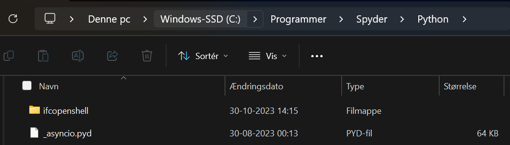

If you're new to IFCopenshell and BIM, this guide is your starting point. It walks you through some essential programs, providing the necessary foundation for your journey into the world of Building Information Modeling (BIM).

## IFC export
I order to export a Revit 3D model as a IFC-file, please follow this guide by clicking [here](./A4/IFC_export.md).

## Installations
### Spyder
Spyder is a open source software, which means that it is free for everyone to use and anyone can contribute to it. Spyder can be used for running and editing python programming scripts.

1.	Start by **downloading Spyder** (standalone).
    1. The standalone installer is the recommended method for most users on Windows and macOS, with experimental Linux support under active development. 
    2. Download the `.exe` installer for **Windows** [here](https://github.com/spyder-ide/spyder/releases/latest/download/Spyder_64bit_full.exe)
    3. Download the `.dmg` installer for **macOS** [here](https://github.com/spyder-ide/spyder/releases/latest/download/Spyder.dmg)
3.	**Open the installer** by double-clicking on the downloaded file.
4.	The installer will now open.
5.	Click **Next >**
6.	Click **I Agree**
7.	Choose “Install for anyone using this computer” and click **Next >** 
8.	Click **Install**
9.	Now open `Spyder`

### BIMvision
BIMvision is a good freeware tool to help you visualize your IFC model. BIMvision shows various properties specific to the model and has many built-in features and plugins.

1. Download BIMvision [here](https://bimvision.eu/download/), shortly after you have entered your email address, you will receive a download link.
2.  Download the `.exe` file, run it, and choose the download directory
3.  You should now be able to open and visualize your IFC models in `BIMvision`

### IFCopenshell

There are different methods of installation, depending on your situation. If you are following this guide and using Spyder and BIMvision, you should choose the Pre-built packages.
1.	Start by downloading IfcOpenShell (newest version) [here](https://blenderbim.org/docs-python/ifcopenshell-python/installation.html#pre-built-packages)
    1. Choose the Pre-built package suitable for your computer’s operating system.
2.	Follow the installation guide for Pre-built package (step 1-3)

> :bulb: **Tip:** Make sure to extract/unzip the `ifcopenshell.zip` file to the Spyder\Python directory.
> 
> 
